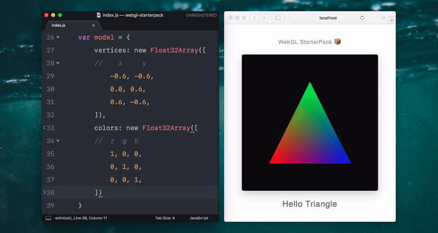

# WebGL StarterPack 📦

Punto de partida para el desarrollo de proyectos con WebGL, aprovechando el poder de [Webpack](https://webpack.js.org) y las ultimas tecnologías web.

### Requisitos
- [node.js](https://nodejs.org/en/)

### Instalación

Clonar el repositorio (o descargar el zip y descomprimirlo) y desde dentro de la carpeta creada ejecutar el siguiente comando desde el terminal:

   __`npm install`__

### Uso

El proyecto presenta los siguientes comandos (ejecutables estando dentro de la carpeta del proyecto):

- __`npm run serve`__ corre un servidor local en [`http://localhost:8080/`](http://localhost:8080/) y lo accede con el buscador por defecto, detectando cambios y refrescando su contenido automáticamente (i.e. [live reloading](#live-reloading)).

- __`npm run build`__ compila el proyecto y deja los archivos generados en la carpeta `dist/`, esta vez aplicando una serie de optimizaciones teniendo en cuenta que ésta es la version que accederá el usuario final (minificación de javascript, etc).

Durante el desarrollo se trabaja sobre la carpeta `src/`, donde se encuentra el archivo raíz `index.ts`, el `html` y assets que se usaran en el proyecto. Ese archivo raíz es el que usa Webpack como punto de partida para construir su grafo de dependencias y compilar el proyecto para su acceso via el servidor local. Webpack es un herramienta excelente y se recomienda la lectura de sus [conceptos básicos](https://webpack.js.org/concepts/).

## Demo

A fin de dar un ejemplo de uso, el repositorio por defecto implementa el clásico _Hello Triangle_.

> Para un ejemplo mas avanzado con manejo de texturas, modelos 3D y librerías externas referirse a este [demo](https://github.com/AgustinBrst/WebGL-StarterPack-Box-Demo).

## Algunos beneficios 📄

### Live Reloading

Ante cualquier cambio en un archivo el buscador se refresca automáticamente. Chau `Ctrl + F5`.

### Shaders / Texturas / Modelos 3D en su lugar

Assets en sus carpetas correspondientes sin cadenas de strings enormes, shaders en el html, etc.

### Conversion a base 64
Opción para convertir imágenes a base 64 agregando `-- --env.base64` al final de cualquiera de las opciones de ejecución (e.g. __`npm run serve -- --env.base64`__).

> ⚠️ La conversion es innecesaria si al proyecto se lo va a publicar en un servidor, cumple la función de esquivar las restricciones definidas en varios buscadores y facilita el compartir proyectos (con abrir el `.html` alcanza) pero puede generar archivos `.js` muy grandes (pensar que las imágenes que estarían en una carpeta `assets` pasan a formar parte del código en forma de texto).
